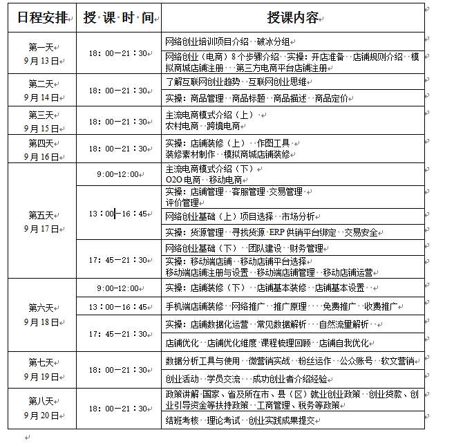




网络创业培训课，实乃时代之需求。然而，教育之路却不曾平坦。我参加此课，始终心有余悸。
首，教学内容并非鱼目混珠，却也难免流于形式。多数学员当场疲态尽显，雷同眩耀；唯有几位拔尖之辈，睿智明察，惊人一击。可谓“腐儒不惜言，碌碌何为？”

次，教师之道亦有所欠缺。虽有恩师传道授业解惑，却有涉浅之嫌。如今之创业，已极复杂多变，需要透过表面看本质，把握市场动态。教师之应用领域经验，恐难跟上时代潮流。

最后，教育对象亦有不少毛病，自视甚高，忽视合作精神。成年人不识好歹，互相攀比，拼命角逐，不仅浪费了机会，更反映了社会浮躁之风。

る，此课或有益处，但仍需有心人慎重斟酌。学习者需时刻保持谦虚，多思考少抱怨；教师们则应更深入市场，磨砺自我。唯有如此，才能真正达到知识的积淀和价值的实现。

