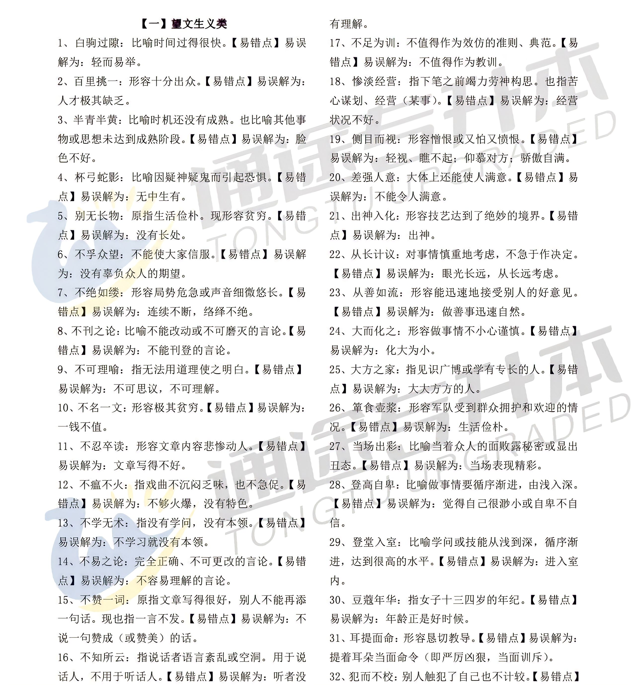

## Day1

### 短歌行   曹操·两汉

对酒当歌，人生几何！譬如朝露，去日苦多。

慨当以慷，忧思难忘。何以解忧？唯有杜康。

青青子衿，悠悠我心。但为君故，沉吟至今。

呦呦鹿鸣，食野之苹。我有嘉宾，鼓瑟吹笙。

明明如月，何时可掇？忧从中来，不可断绝。

越陌度阡，枉用相存。契阔谈讌，心念旧恩。

月明星稀，乌鹊南飞。绕树三匝，何枝可依？

山不厌高，海不厌深。周公吐哺，天下归心。


### 归园田居·其一   陶渊明·魏晋


少无适俗韵，性本爱丘山。

误落尘网中，一去三十年。(误落 一作：误入)

羁鸟恋旧林，池鱼思故渊。

开荒南野际，守拙归园田。

方宅十余亩，草屋八九间。

榆柳荫后檐，桃李罗堂前。

暧暧远人村，依依墟里烟。

狗吠深巷中，鸡鸣桑树颠。

户庭无尘杂，虚室有余闲。

久在樊笼里，复得返自然。 



## Day2

### 蜀相    杜甫·唐


丞相祠堂何处寻？锦官城外柏森森。

映阶碧草自春色，隔叶黄鹂空好音。

三顾频烦天下计，两朝开济老臣心。

出师未捷身先死，长使英雄泪满襟。 


### 行路难·其一 李白·唐


金樽清酒斗十千，玉盘珍羞直万钱

停杯投箸不能食，拔剑四顾心茫然。

欲渡黄河冰塞川，将登太行雪满山。

闲来垂钓碧溪上，忽复乘舟梦日边。

行路难！行路难！多歧路，今安在？

长风破浪会有时，直挂云帆济沧海。


### 晒旧衣  周寿昌·清


卅载绨袍检尚存，领襟虽破却余温。

重缝不忍轻移拆，上有慈亲旧线痕。



- 绨袍：粗绨所制造的袍子。
- 绨（tì）：丝织物类名。
- 卅：三十；廿：二十

## Day3

### 氓

**诗经·国风·卫风〔先秦〕**


氓之蚩(chī)蚩　抱布贸丝
匪来贸丝　来即我谋
送子涉淇　至于顿丘
匪我愆(qiān)期　子无良媒
将(qiāng)子无怒　秋以为期

乘彼垝(guǐ)垣(yuán)　以望复关
不见复关　泣涕涟涟
既见复关　载笑载言
尔卜尔筮(shì)　体无咎言
以尔车来　以我贿迁

桑之未落　其叶沃若
于(xū)嗟鸠兮　无食桑葚(shèn)
于嗟女兮　无与士耽
士之耽兮　犹可说(tuō)也
女之耽兮　不可说也

桑之落矣　其黄而陨(yǔn)
自我徂(cú)尔　三岁食贫
淇水汤(shāng)汤　渐(jiān)车帷裳(cháng)
女也不爽　士贰(dài)其行(háng)
士也罔极　二三其德

三岁为妇　靡室劳矣
夙兴夜寐　靡有朝(zháo)矣
言既遂矣　至于暴矣
兄弟不知　咥(xī)其笑矣
静言思之　躬自悼(dào)矣

及尔偕老　老使我怨
淇则有岸　隰(xí)则有泮(pàn)
总角之宴　言笑晏晏
信誓旦旦　不思其反
反是不思　亦已焉哉


### 水龙吟·登建康赏心亭

**辛弃疾〔宋代〕**

楚天千里清秋，水随天去秋无际。遥岑远目，献愁供恨，玉簪螺髻。落日楼头，断鸿声里，江南游子。把吴钩看了，栏杆拍遍，无人会，登临意。(栏杆 一作：阑干)
休说鲈鱼堪脍，尽西风，季鹰归未？求田问舍，怕应羞见，刘郎才气。可惜流年，忧愁风雨，树犹如此！倩何人唤取，红巾翠袖，揾英雄泪！(脍 同：鲙)


### 天净沙·秋思

**马致远〔元代〕**

枯藤老树昏鸦，小桥流水人家，古道西风瘦马。夕阳西下，断肠人在天涯。


