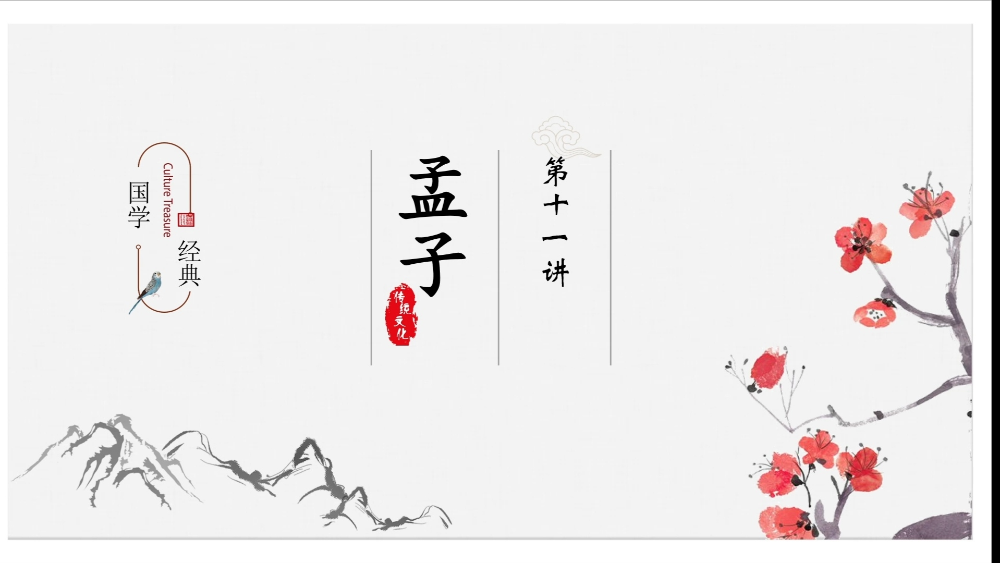
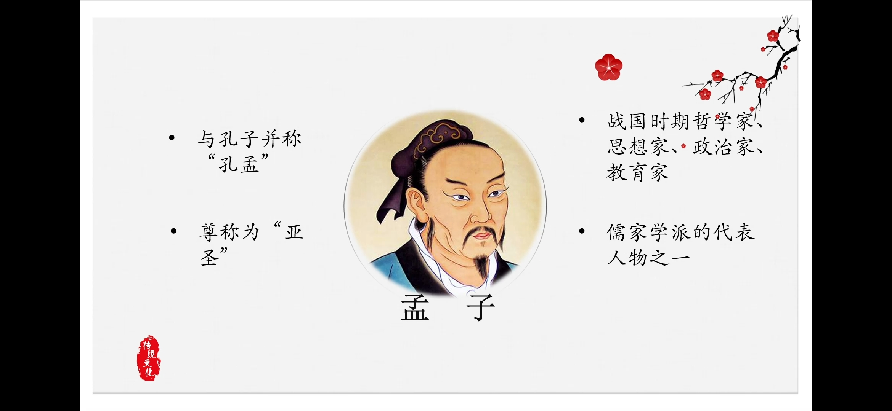
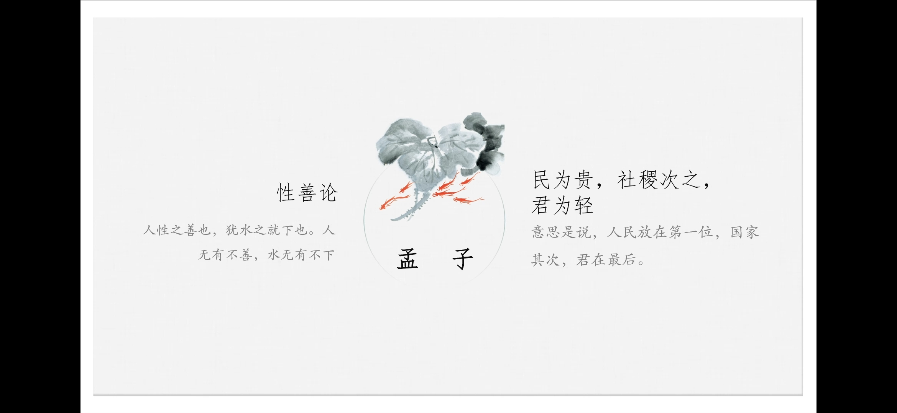
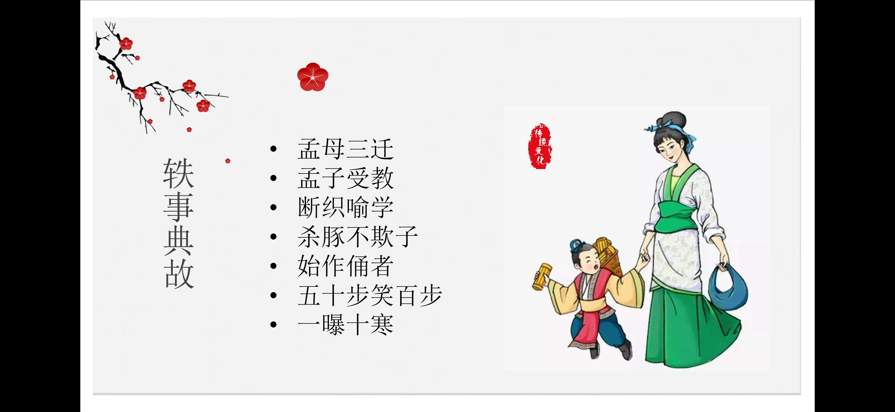
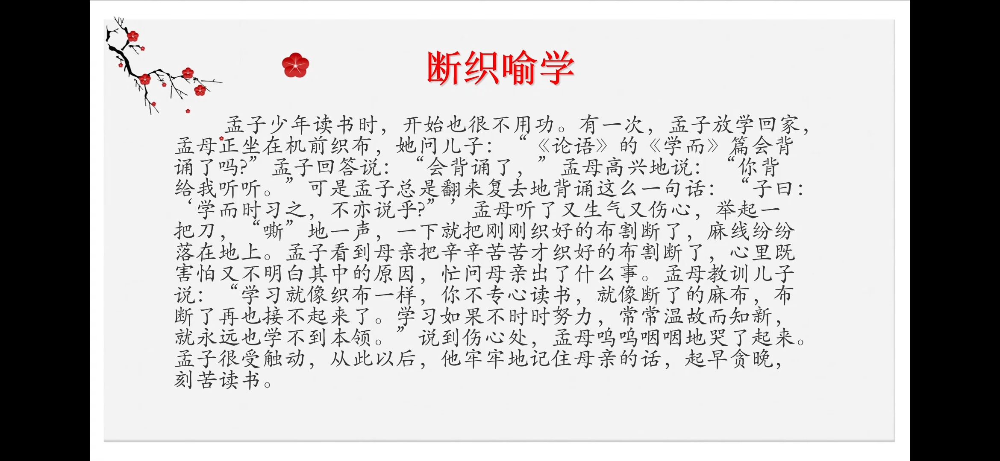
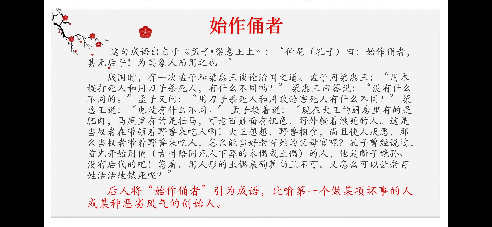
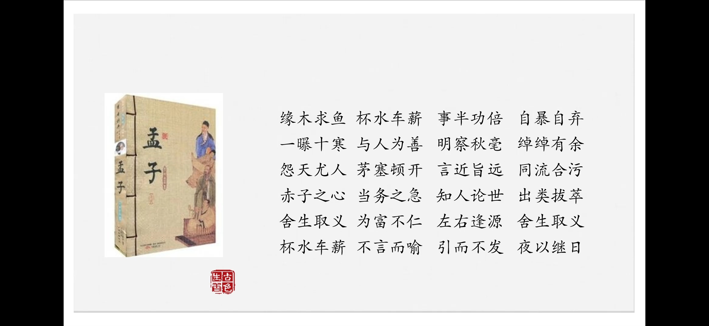
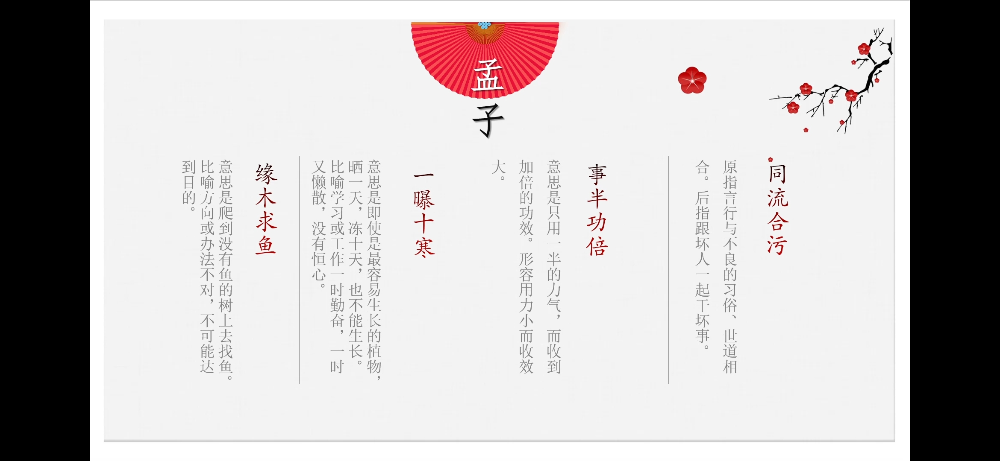
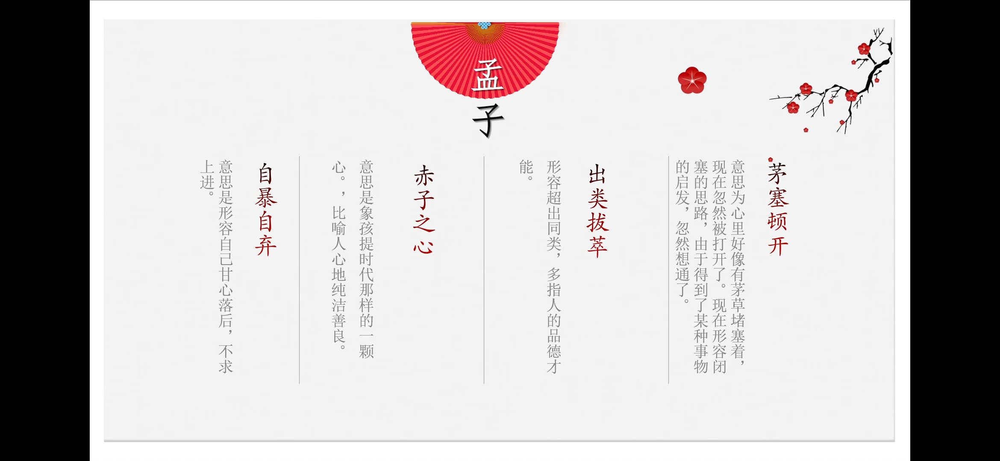

# 《国语》简介

## 《国语》是一部国别史

- 全书二十一卷，分别记载周、鲁、齐、晋、郑、楚、吴、越八国事，是各国史料的汇编。成书约在战国初年。

## 《国语》体制：记言为主，记事为辅。

- 司马迁说：“左丘失明，厥有《国语》。”从此一般都认为《国语》乃左丘明所作。由于《国语》在内容上比较接近《左传》，又具有同样的史料价值，所以《国语》又有《春秋外传》之称

## 《国语》的思想倾向：儒家的崇礼重民。

- 民本思想
- 肯定和赞扬了有卓识远见的政治家、爱国者和在历史上起过进步作用的人
  - 《齐语》“管仲佐桓公称霸诸侯”
    - 《越语》中“勾践灭吴”
    - 揭露统治者争权夺利、尔虞我诈、骨肉相残的丑恶残暴行为
      - 《国语》对于统治者的揭露，毫不隐恶。如《晋语》中的“骊姬之乱”，主要写晋侯家族内部的故事，他们为了争夺太子之位，互相残杀，阴谋诡计层出不穷，骨肉之情荡然无存，作者深刻揭露了统治者凶残的本性，可见思想的进步性。这是全书对统治阶级丑恶行径的描写最为精彩、最为规模宏大的故事。

      ## 《国语》的记言特征
      《国语》所记之言：多为朝聘、飨宴、讽谏、辩诘、应对之辞。
      ## 《国语》记言特点如下：
      1. 具有极强的政论性。
      2. 具有极强的议论性
      - 结构模式的议论性
      - 文字说理的议论性
      3.   富有形象性。
      4. 具有差异性。
      5. 《国语》的辞令

      # 内容xxx

      

      厉王虐，国人谤王。
      周厉王暴虐无道，国人公开批评指责他。

      

      

      国人莫敢言,道路以目。
      国人都不敢说话，在路上遇见，也只是用眼神（示意）。
      

      

      王不听，于是国人莫敢言，三年，乃流王于彘(zhi)。

      译：周厉王不听。于是百姓再也不敢说话了。过了三年，百姓就把厉王放逐到彘。

      

      ## 召公谏言四个层次：

      1、以治河为喻，说明治理人民必须使其畅所欲言；

      2、以前代统治者施政成功的做法为例，说明君王要广开言路；

      3、以土地生财为喻，说明依据人民的言论可以制定利民兴国的政策；

      4、以言论是思想的自然流露为由，说明堵嘴将导致众叛亲离。

      ## 整体把握全文分三段：
      第一段，写厉王弭谤的方法，寥寥几笔，便写出王虐民怨的状况。

      第二段，写召公谏弭谤，从正反两面反复阐明不可“防民之口”，恳切有力。

      第三段，写弭谤的结果，“流王于彘”，完全应验了召公的谏言。

      ## 写作特色
      （1）逻辑严密，说服力强。
      （2）比喻生动形象。
      - 召公针对厉王的暴政，以“为川”为喻，警诫厉王要尊重民意，体察民情，弭谤犹如壅川，“川壅而溃，伤人必多”。寓说理于比喻之中，含有深刻的哲理
      - 把“民之有口”比喻为“土之有山川也”，从积极的方
      面指出，应当正确认识民“谤”，才能做到“行善而备败”。

      ## 主要人物形象
      - 召公：召公即召穆公，仗义直言、远见卓识、重视人民群众的意见、反对镇压措施。咨公把以民为本的思想用于具体的弭谤之事，运用独特的方法进行劝谏，表现了一个优秀政治家对国家的高度责任感。

      - 厉王：文中刻画了这个暴虐凶残、刚愎自用、拒不纳谏的独夫形象。

      ## 影响：

      

      《召公谏厉王弭谤》文中提出的“防民之口，甚于防川”，“为川者决之使导，为民者宣之使言”，已经成为历代传诵的名言。

      

      

      《荀子·王制篇》：“君者舟也，庶人者水也。水则载舟,水则覆舟”。

      

      
      魏征的《谏太宗十思疏》：“怨不在大，可畏惟人；载舟覆舟，所宜深慎。”
      

# 有为神农之言者许行

## 孟子简介
孟子（前372年一前289年），名轲，字子舆（一说字子车或子居）。邹国（今山东邹城）人。孟子与孔子合称孔孟，其道被称为“孔孟之道”。孔子是至圣,孟子是亚圣。古代著名思想家，教育家，政治家，政论家和散文家，战国时期儒家代表人物，授业于孔子嫡孙孔伋的门人。继承并发扬孔子的思想，批驳杨朱,墨翟。
## 孟子思想

## 孟子教育思想：得天下英才而教育之
- “谨庠（xiáng）序之教，申之以孝悌（ti）之义，颁白者不负戴于道路矣”
## 轶事典故
  - 孟母三迁
  - 孟子受教
  - 断织喻学
  - 杀豚不欺子
  - 始作俑者
  - 五十步笑百步
  - 一曝十寒

- 成语典故
缘木求鱼 杯水车薪 事半功倍 自暴自弃
一曝十寒 与人为善 明察秋毫 绰绰有余
怨天尤人 茅塞顿开 言近旨远 同流合污赤子之心 当务之急 知人论世出类拔萃舍生取义 为富不仁左右逢源
舍生取义杯水车薪 不言而喻引而不发夜以继日

## 《孟子》名句

•得道者多助，失道者寡助。
·天时不如地利，地利不如人和。
·故天将降大任于是人也，必先苦其心志，劳其筋骨，饿其体肤，空乏
其身，行拂乱其所为，所以动心忍性，曾益其所不能。
生，亦我所欲也；义，亦我所欲也。两者不可得兼，舍生而取义者也。
·尽信书则不如无书。
•富贵不能淫，贫贱不能移，威武不能屈，此之谓大丈夫。
·老吾老，以及人之老；幼吾幼，以及人之幼。
•民为贵，社稷次之，君为轻。


## 伦理道德
- 提倡人与人应当互相亲爱，以保持人际关系的和谐
- 道德规范：仁、义、礼、智。
- 人伦关系：“父子有亲，君臣有义，夫妇有别，长幼有序，朋友有信。”《孟子·滕文公上》，父子之间有慈爱，君臣之间有礼义，夫妇之间有区别，老少之间有等级，朋友之间有诚信。
- 理想人格：“富贵不能淫，贫贱不能移，威武不能屈”。认为人格的重要远远高于财富、权力、地位。主张做人要做有“浩然之气”的“大丈夫”。怎样蓄积“浩然之气”，那就是:
一要持志养气，坚持崇高的志向追求;
二要“动心忍性”，有意识地在逆境中磨砺意志；
三要“存心养性”，就是要清心寡欲。孟子的这些主张和理论是对中国传统文化的重要贡献。
浩然之气的“大丈夫”，自古以来激励了无数的志士，诚如冯友兰先生所说：“懂得了这个词汇，才可以懂得中国文化和中华民族的精神。”

## 关于许行
许行（约公元前372年~289年），楚郢都（今荆州纪南）人。生于楚宣王至楚怀王时期。战国时期著名农学家、思想家。
## 许行农家思想核心是反对不劳而食
## 人、民、氓的差别
- “人”是教化者，“民”是教化的对象
- “氓”也是“民”，不同处在于：“民”是安土重迁、被束缚在一块地方的百姓或奴隶，“氓”是由“亡民”组成的，是脱离原有土地逃亡或流亡在外的“民”。故“氓”可跟“流”联合组词“流氓”，古代只指流浪者、无业游民，不指行为不端的人。

