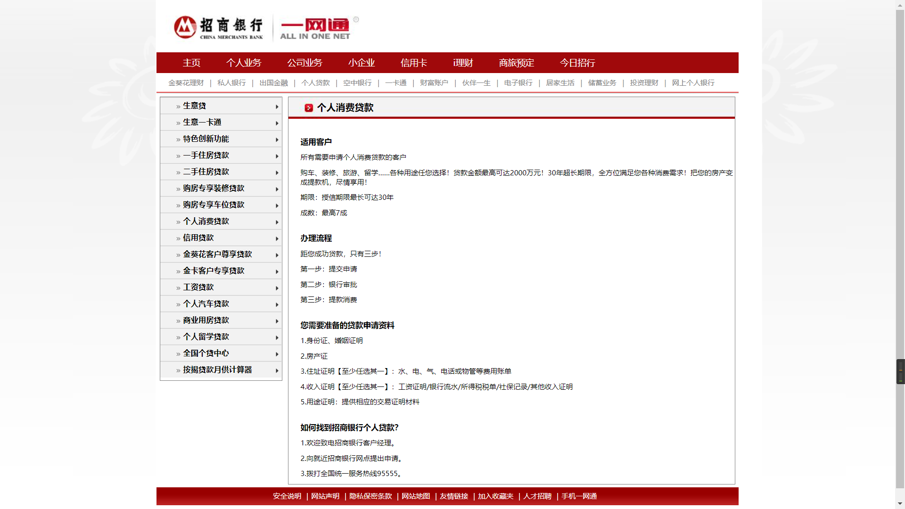


```
<!doctype html>
<html>

<head>
    <meta charset="utf-8">
    <title>综合实例——招商银行</title>
    <style>
        /* CSS Document */

        * {
            margin: 0px;
            padding: 0px;
        }

        body {
            font-size: 12px;
            background-image: url(bg.gif);
            background-repeat: no-repeat;
            background-position: center top;
        }

        #wrapper {
            width: 980px;
            margin: 0 auto;
        }


        /*页首样式*/
        header {
            padding-bottom: 15px;
            background-image: url(main_line.jpg);
            background-repeat: repeat-x;
            background-position: bottom;
        }

        /*主导航样式*/
        .mainnavi {
            background-image: url(main_menu_bg.gif);
            background-repeat: repeat-x;
        }

        .mainnavi ul {
            font-size: 14.7px;
            font-weight: bold;
            padding-top: 9px;
            padding-bottom: 8px;
            margin-left: 30px;
        }

        .mainnavi li {
            display: inline;
            padding-right: 20px;
            padding-left: 17px;
            border-right-width: 1px;
            border-right-style: solid;
            border-right-color: #88180F;
        }

        /*副导航样式*/
        .subnavi ul {
            text-align: center;
            font-size: 12px;
            padding-top: 10px;
            padding-bottom: 10px;
        }

        .subnavi li {
            display: inline;
            border-right-width: 1px;
            border-right-style: solid;
            border-right-color: #999;
            padding-right: 10px;
            margin-right: 7px;
        }


        /*左侧边栏样式*/
        .leftsider {
            clear: none;
            float: left;
            width: 210px;
            border-right-width: 1px;
            border-bottom-width: 1px;
            border-left-width: 1px;
            border-right-style: solid;
            border-bottom-style: solid;
            border-left-style: solid;
            border-right-color: #CCC;
            border-bottom-color: #CCC;
            border-left-color: #CCC;
        }

        .leftsider ul {
            list-style-type: none;
            background-image: url(directory_bg_big.gif);
            padding-left: 50px;
        }

        .leftsider li {
            padding-top: 9px;
            padding-bottom: 7px;
        }

        .leftsider a:link,
        .leftsider a:visited {
            color: #000;
            text-decoration: none;
        }

        .leftsider a:hover {
            color: #F00;
        }

        /*右侧正文样式*/
        .content {
            clear: none;
            float: right;
            width: 723px;
            padding-left: 20px;
            border: 1px solid #CCC;
        }

        .content header {
            margin-left: -20px;
            background-image: url(content_bg.jpg);
            padding: 0px;
        }

        .content h1 {
            font-size: 14.7px;
            padding-top: 8px;
            padding-bottom: 7px;
            padding-left: 55px;
        }

        .content h2 {
            font-size: 12px;
            margin-top: 25px;
            margin-bottom: 10px;
        }

        .content p {
            line-height: 1.5em;
            margin-top: 10px;
            margin-bottom: 10px;
        }

        /*页底样式*/

        .clear {
            clear: both;
        }

        footer {
            background-image: url(bottom_bg.gif);
            background-repeat: repeat-x;
            margin-top: 15px;
        }

        footer ul {
            list-style-type: none;
            text-align: center;
            padding-top: 10px;
            padding-bottom: 10px;
        }

        footer li {
            display: inline;
            border-right-width: 1px;
            border-right-style: solid;
            border-right-color: #999;
            padding-right: 10px;
            margin-right: 7px;
        }

        /*主/副导航条、底部导航条超链接样式*/
        .mainnavi a:link,
        .mainnavi a:visited,
        footer a:link,
        footer a:visited {
            color: #FFF;
            text-decoration: none;
        }

        .mainnavi a:hover,
        footer a:hover {
            color: #000;
        }

        .subnavi a:link,
        .subnavi a:visited {
            color: #666;
            text-decoration: none;
        }

        .subnavi a:hover {
            color: #F00;
        }

        /*主/副导航条、底部导航条去掉边框*/
        .mainnavi .noborder,
        .subnavi .noborder,
        footer .noborder {
            border: none;
        }
    </style>
</head>

<body>
    <!-- 页面开始 -->
    <div id="wrapper">

        <!-- 页首开始 -->
        <header><a href="http://www.cmbchina.com/"></a>
            <!-- 主导航开始 -->
            <nav class="mainnavi">
                <ul>
                    <li><a href="#">主页</a></li>
                    <li><a href="#">个人业务</a></li>
                    <li><a href="#">公司业务</a></li>
                    <li><a href="#">小企业</a></li>
                    <li><a href="#">信用卡</a></li>
                    <li><a href="#">i理财</a></li>
                    <li><a href="#">商旅预定</a> </li>
                    <li class="noborder"><a href="#">今日招行</a></li>
                </ul>
            </nav>
            <!-- 主导航结束 -->
            <!-- 副导航开始 -->
            <nav class="subnavi">
                <ul>
                    <li><a href="#">金葵花理财</a></li>
                    <li><a href="#">私人银行</a></li>
                    <li><a href="#">出国金融</a></li>
                    <li><a href="#">个人贷款</a></li>
                    <li><a href="#">空中银行</a></li>
                    <li><a href="#">一卡通</a></li>
                    <li><a href="#">财富账户</a></li>
                    <li><a href="#">伙伴一生</a></li>
                    <li><a href="#">电子银行</a></li>
                    <li><a href="#">居家生活</a></li>
                    <li><a href="#">储蓄业务</a></li>
                    <li><a href="#">投资理财</a></li>
                    <li class="noborder"><a href="#">网上个人银行</a></li>
                </ul>
            </nav>
            <!-- 副导航结束 -->
        </header>
        <!-- 页首结束 -->

        <!-- 左侧边栏开始 -->
        <div class="leftsider">
            <aside>
                <nav>
                    <ul>
                        <li><a href="#">生意贷</a></li>
                        <li><a href="#">生意一卡通</a></li>
                        <li><a href="#">特色创新功能</a></li>
                        <li><a href="#">一手住房贷款</a></li>
                        <li><a href="#">二手住房贷款</a></li>
                        <li><a href="#">购房专享装修贷款</a></li>
                        <li><a href="#">购房专享车位贷款</a></li>
                        <li><a href="#">个人消费贷款</a></li>
                        <li><a href="#">信用贷款</a></li>
                        <li><a href="#">金葵花客户尊享贷款</a></li>
                        <li><a href="#">金卡客户专享贷款</a></li>
                        <li><a href="#">工资贷款</a></li>
                        <li><a href="#">个人汽车贷款</a></li>
                        <li><a href="#">商业用房贷款</a></li>
                        <li><a href="#">个人留学贷款</a></li>
                        <li><a href="#">全国个贷中心</a></li>
                        <li><a href="#">按揭贷款月供计算器</a></li>
                    </ul>
                </nav>
            </aside>
        </div>
        <!-- 左侧边栏结束 -->

        <!-- 右侧正文开始 -->
        <div class="content">
            <article>
                <header>
                    <h1>个人消费贷款</h1>
                </header>
                <section>
                    <h2>适用客户</h2>
                    <p>所有需要申请个人消费贷款的客户</p>
                    <p>购车、装修、旅游、留学……各种用途任您选择！贷款金额最高可达2000万元！30年超长期限，全方位满足您各种消费需求！把您的房产变成提款机，尽情享用！</p>
                    <p>期限：授信期限最长可达30年</p>
                    <p>成数：最高7成</p>
                </section>
                <section>
                    <h2>办理流程</h2>
                    <p>距您成功贷款，只有三步！</p>
                    <p>第一步：提交申请</p>
                    <p>第二步：银行审批</p>
                    <p>第三步：提款消费</p>
                </section>
                <section>
                    <h2>您需要准备的贷款申请资料</h2>
                    <p>1.身份证、婚姻证明</p>
                    <p>2.房产证</p>
                    <p>3.住址证明【至少任选其一】：水、电、气、电话或物管等费用账单</p>
                    <p>4.收入证明【至少任选其一】：工资证明/银行流水/所得税税单/社保记录/其他收入证明</p>
                    <p>5.用途证明：提供相应的交易证明材料 </p>
                </section>
                <section>
                    <h2>如何找到招商银行个人贷款？</h2>
                    <p>1.欢迎致电招商银行客户经理。</p>
                    <p>2.向就近招商银行网点提出申请。</p>
                    <p>3.拨打全国统一服务热线95555。</p>
                </section>
            </article>
        </div>
        <!-- 右侧正文结束 -->

        <div class="clear"></div>
        <!-- 页脚开始 -->
        <footer>
            <ul>
                <li><a href="#">安全说明</a></li>
                <li><a href="#">网站声明</a></li>
                <li><a href="#">隐私保密条款</a></li>
                <li><a href="#">网站地图</a></li>
                <li><a href="#">友情链接</a></li>
                <li><a href="#">加入收藏夹</a></li>
                <li><a href="#">人才招聘</a></li>
                <li class="noborder"><a href="#">手机一网通</a></li>
            </ul>
        </footer>
        <!-- 页脚结束 -->

    </div>
    <!-- 页面结束 -->
</body>

</html>
```


# 效果图
