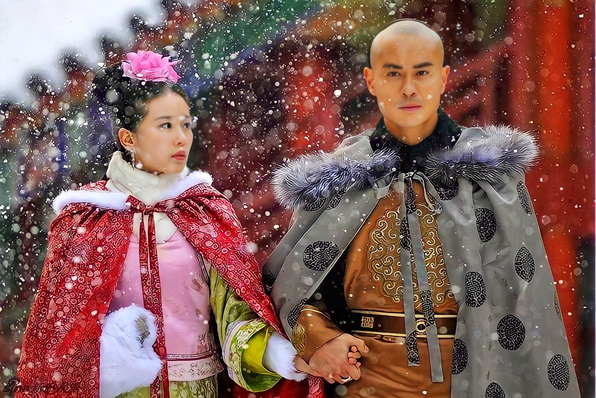
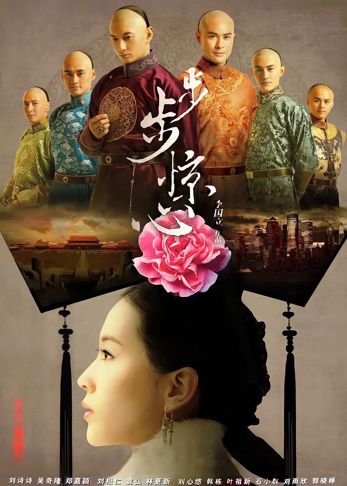
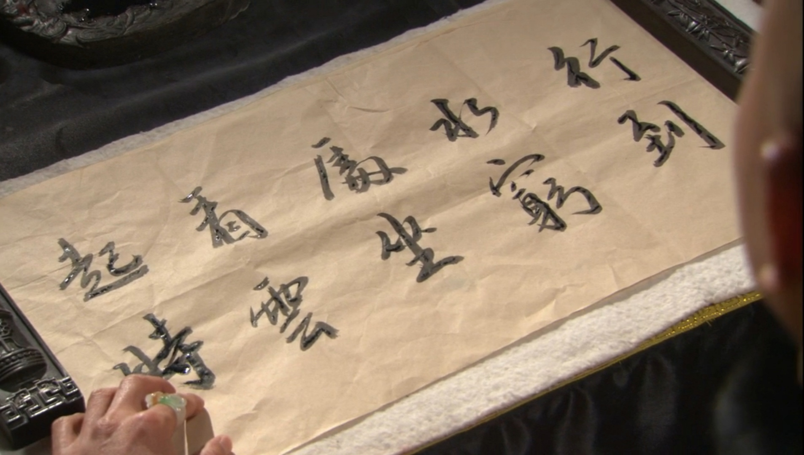
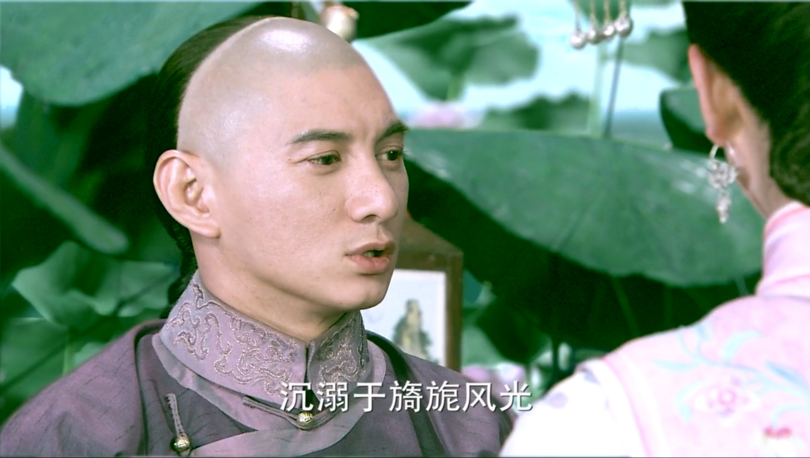
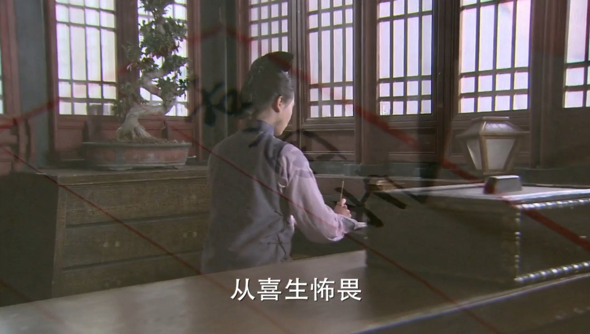
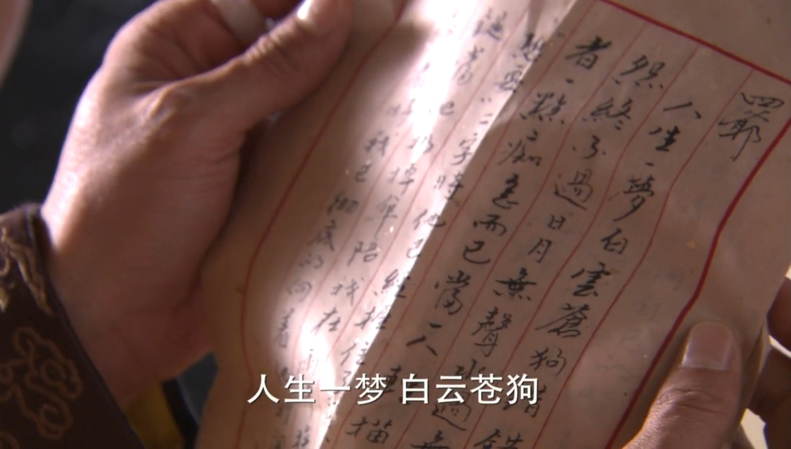
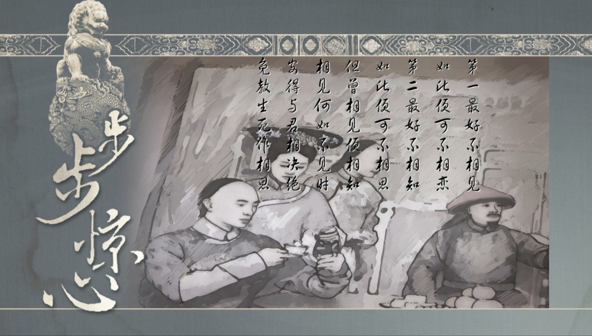


　　胤禛：

　　人生一梦，白云苍狗。错错对对，恩恩怨怨，终不过日月无声、水过无痕。所难弃者，一点痴念而已！当一人轻描淡写地说出“想要”二字时，他已握住了开我心门的钥匙；当他扔掉伞陪我在雨中挨着、受着、痛着时，我已彻底向他打开了门；当他护住我，用自己的背朝向箭时，我已此生不可能再忘。之后是是非非，不过是越陷越深而已。话至此处，你还要问起八爷吗？
　　由爱生嗔，由爱生恨，由爱生痴，由爱生念。从别后，嗔恨痴念，皆化为寸寸相思。不知你此时，可还怨我恨我？恼我怒我？紫藤架下，月冷风清处，笔墨纸砚间，若曦心中没有皇帝，没有四阿哥，只有拿去我魂魄的胤禛一人！相思相望不相亲，薄情转是多情累，曲曲柔肠碎。红笺向壁字模糊，曲阑深处重相见，日日盼君至。
　　   ——若曦


繁华喧嚣的现代化大都市，生活着一个美丽聪颖的白领丽人张晓（刘诗诗 饰）。某天，她和男友争吵发生事故，而这一变故竟让他的灵魂穿越了数百年来到清朝，身份也变成了一名满族贵族少女——马尔泰•若曦。时为康熙四十三年，正是天下已定，举世太平的时节。然而繁荣的表象下暗潮涌动，杀机四伏，康熙大帝（刘松仁 饰）一生运筹帷幄，如今面临着最重要也是最凶险的抉择，那便是下一任皇帝的人选。四阿哥胤禛（吴奇隆 饰）深沉内敛，城府颇深；十四阿哥胤祯（林更新 饰）重情重义、且野心勃勃；八阿哥胤禩（郑嘉颖 饰）温润如玉、然身不由己。若曦和一众柔情女儿卷入其中，见证了九子夺嫡的历史时刻…… 本片根据桐华同名的穿越网络小说改编。 


邶风·式微
式微，式微！胡不归？微君之故，胡为乎中露！
式微，式微！胡不归？微君之躬，胡为乎泥中！


鹊桥仙·秦观

纤云弄巧，飞星传恨，银汉迢迢暗度。

金风玉露一相逢，便胜却人间无数。

柔情似水，佳期如梦，忍顾鹊桥归路。

两情若是久长时，又岂在朝朝暮暮。




王维·《终南别业》

行到水穷处，坐看云起时。



我心匪鉴，不可以茹。亦有兄弟，不可以据。薄言往愬，逢彼之怒。

我心匪石，不可转也。我心匪席，不可卷也。威仪棣棣，不可选也。

忧心悄悄，愠于群小。觏闵既多，受侮不少。静言思之，寤辟有摽。

日居月诸，胡迭而微。心之忧矣，如匪浣衣。静言思之，不能奋飞。



诗经·邶风·击鼓

击鼓其镗，踊跃用兵。土国城漕，我独南行。 　　

从孙子仲，平陈与宋。不我以归，忧心有忡。 　　

爰居爰处？爰丧其马？于以求之？于林之下。 　　

死生契阔，与子成说。执子之手，与子偕老。 　　

于嗟阔兮，不我活兮。于嗟洵兮，不我信兮。



沉溺于旖旎风光，只会失了心智，便也不会成为后来的雍正皇帝！



丑爱生嗔，由爱生恨，由爱生痴，由爱生念。从别后 ，嗔恨痴念， 皆化为寸寸相思。不知你此时， 可还怨 我恨我，恼我怒我？紫藤架下，月冷风清处，笔墨纸 砚间， 若曦心中没有皇帝，没有四阿哥，只有拿去我 魂魄的胤稹一人！ 相思相望不相亲，薄情转是多情累 ，曲曲柔肠碎。 红笺向壁字模糊，曲阑深处重相见， 日日盼君至。



第一最好不相见，如此便可不相恋；第二最好不相知 ，如此便可不相思。 但曾相见便相知， 相见何如不见时。安得与君相 诀绝， 免教生死作相思。 良辰美景奈何天， 赏心乐事谁家院。



只愿君心似我心， 定不负相思意



从喜生忧患，从喜生怖畏；离喜无忧患，何处有怖畏？从爱生忧患，从爱生怖畏；离爱无忧患，何处有怖畏？是故莫爱着，爱别离为苦。若无爱与憎，彼即无羁缚。



贝勒爷之才，足安天下

贝勒爷之情，镜花水月



太子四岁四书五经，十岁蒙满汉三语。



知止而后有定，定而后能静，静而后能安，安而后能虑，虑而后有得，​物有本末，事有终​始​


