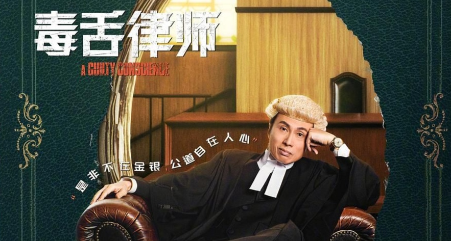
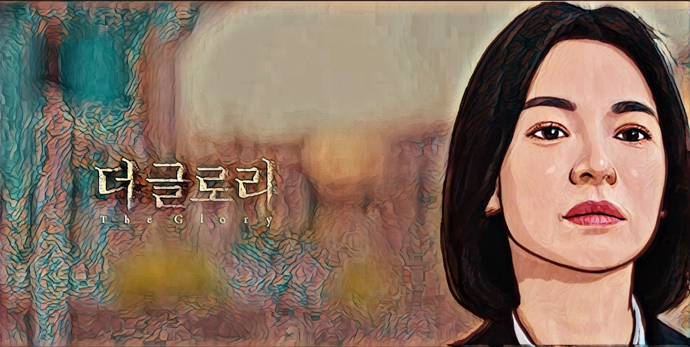
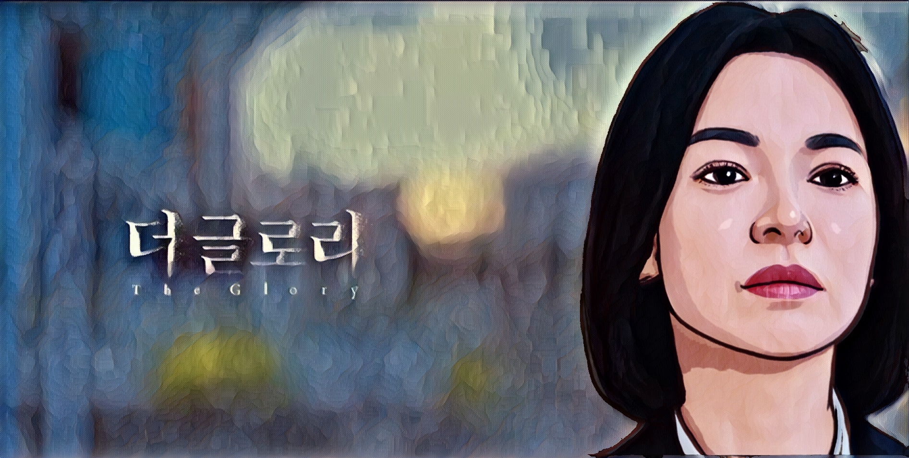

# 动漫
- 《刀剑神域》
- 《天国大魔境》
- 《鬼灭之刃》
- 《画江湖之不良人》
# 电视剧
- 大陆剧情
- 《回响》
- 《无间》
- 近代历史剧
  - 《白鹿原》
- 古装
  - 《云襄传》
  - 《长风渡》
  - 《天醒之路》

# 港片
- 《毒舌律师》

Something is wrong.


- 《无间道》

# 韩剧
- 《浪漫医生金师傅》
- 《黑暗荣耀》⭐⭐

### 长风渡

 布商之女柳玉茹自小遭遇生母病重、庶母不慈、父亲不重视的困境，她不得已谨小慎微，做了十几年模范闺秀。不料，对婚姻抱有憧憬的她却被家里安排嫁给了名满扬州的纨绔顾九思。顾九思误会柳玉茹是为了攀附权贵才嫁给他，对其嗤之以鼻。柳玉茹幡然醒悟，不能将命运系之婚姻、系之他人，决定跟随顾母学习经商之道，真实、独立、精彩地实现自我价值。经过努力，柳玉茹在生意上逐渐得心应手，更在此过程中发现了顾九思至纯至善、炽热真诚的一面，两个人的心也越靠越近。然而此时，扬州节度使倒行逆施，导致百姓流离失所，顾家不得已举家逃亡。顾九思看着万千流民，一夜之间长大。为结束乱局，让百姓安居，顾九思从捕快做起，官至户部尚书，与志同道合者扫除积弊、轻税轻徭。柳玉茹则内修善堂、外建商交，使得物资繁盛、百姓安康，两人共同谱写了一段盛世佳话。 